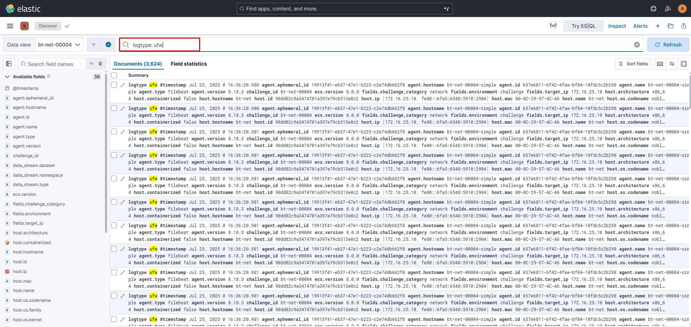
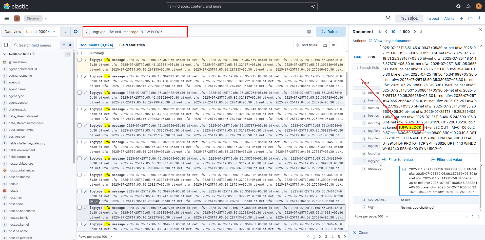
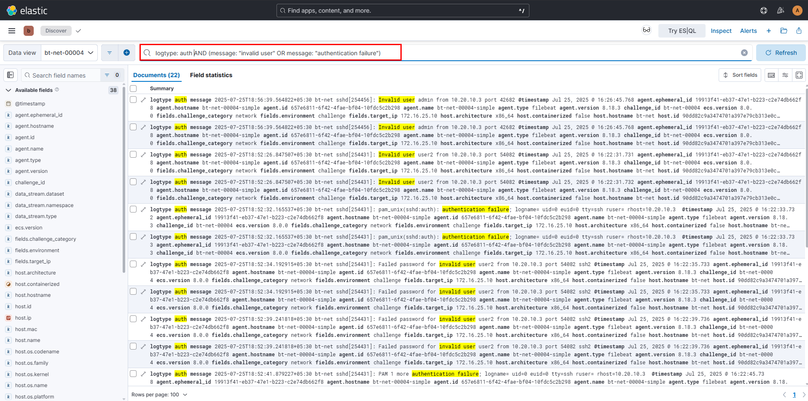
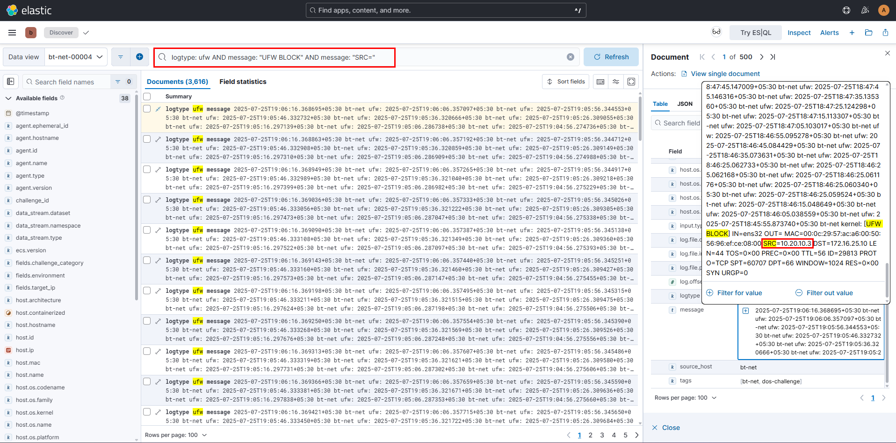
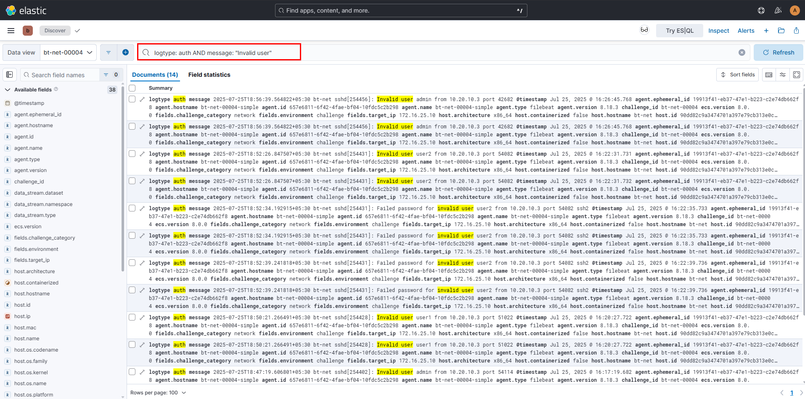
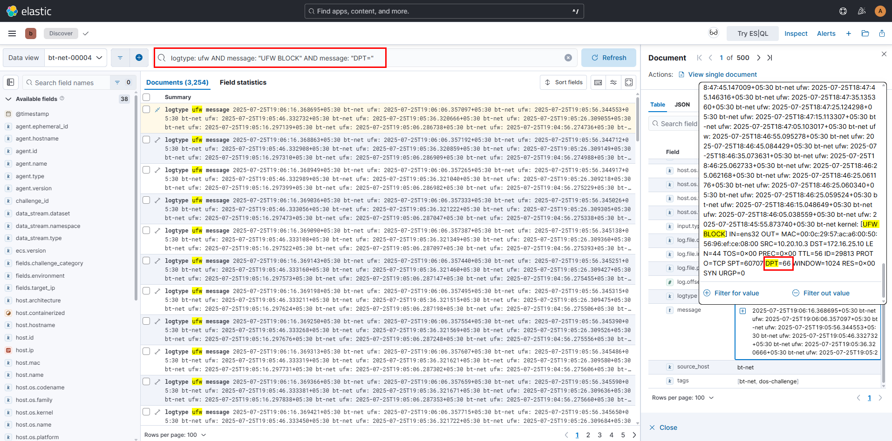
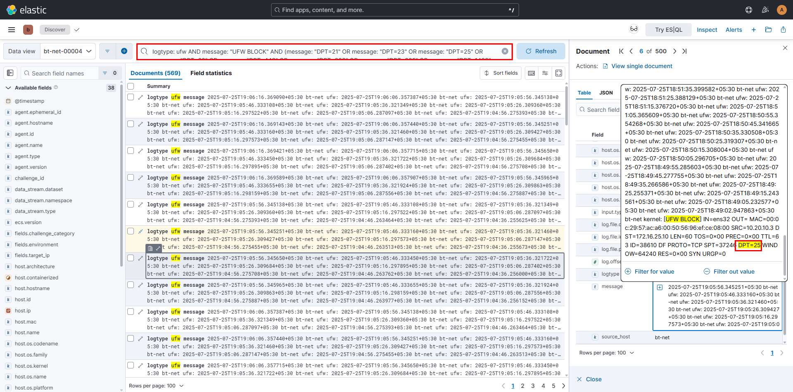

# Threat-Hunting-DoS-Activity-Investigation-and-Analysis

In this investigation we have a possibility of a Denial of Service attack that has affected an Organization targeting its critical network infrastructure. The security monitoring has detected high-volume of connection attempts, systematic port scanning activities, aggressive authentication brute force attacks and patters indicative of distributed denial of service behavior.

#### Denial of Service

This is an attack where the malicious actor floods the server with high traffic in order to render the server inactive to process requests, leaving users unable to access the services. *DDOS (Distributed Denial of Service)* is an attack on servers by multiple compromised computers called botnets that overwhelm the targeted machine until normal traffic is not able to be processed. This attack is categorized into two main categories that is [*Buffer Overflow Attacks*](https://www.cloudflare.com/learning/security/threats/buffer-overflow/) and *[Flood Attacks](https://www.cloudflare.com/learning/ddos/http-flood-ddos-attack/)*

#### Port Scanning

A port scan is a common tactic used by attackers to find open ports or weak points in a network. This scans can expose services running, versions, users who own services, whether anonymous logins are allowed and which network services require authentication. Businesses also perform port scanning to check for any potential weakness in there organization.

#### Brute Force Attack

This is a trial and error method attackers uses to gain access to a system, crack passwords, login credentials and encryption keys. This is one by trying multiple username and passwords on a wide range of combinations until they find the correct login credential.

## Investigation Methodology

Below are the key points that we will use to proceed with the investigation

- High-volume connection pattern analysis in UFW logs
- Port scanning and service enumeration detection
- Authentication brute force pattern identification
- Resource exhaustion behavior analysis
- Attack vector distribution assessment
- Traffic volume and frequency correlation
- Attack duration and persistence analysis

#### Tools

The tool we will use for our hunt is the Elastic SIEM which is used for threat hunting, data analytics and endpoint security which can help SOC analysts, Threat hunters Identify, Investigate and respond to threats across cloud, endpoint and on-premises environments


---

### 1 - High-volume connection pattern analysis in UFW logs

UFW Firewall is an interface for `iptables` designed to make configuration straightforward on Ubuntu systems. Looking at the UFW logs will help us in identifying DoS Specific patterns. Executing the query below we will be filtering out specific events related to the UFW firewall activities

```
logtype: ufw
```



UFW logs give us details on Destination ports, IP addresses, connection attempts and packet characteristics which will help us in our investigation.

***MITRE Att&ck***

| ID | Technique |
| --- | --- |
| T1190 | Exploit Public-Facing Application |
| T1595.001 | Active Scanning: Scanning IP Blocks |

---

### 2 - Port scanning and service enumeration detection

DOS attacks often begins by port scanning and by this we will us the query below looking for any blocked connections within a short period of time which is a high indication of DoS activity

```
logtype: ufw AND message: "UFW BLOCK"
```



Looking at the time we can see they are short periods of blocks by the UFW Firewall a clear indication of port scanning activity

***MITRE Att&ck***

| ID | Technique |
| --- | --- |
| T1046 | Network Service Discovery |
| T1595.002 | Active Scanning: Vulnerability Scanning |

---

### 3 - Authentication brute force pattern identification

Denial of Service attacks often include authentication attempts to overwhelm the login services and consume resources and in this case we will filter based on `invalid user` and `authentication failure` under the `auth` log type

```
logtype: auth AND (message: "Invalid user" OR message: "authentication failure")
```



As seen multiple invalid user login attempts and authentication failures proves the point further that this is indeed a DoS attack.

***MITRE Att&ck***

| ID | Technique |
| --- | --- |
| T1110.001 | Brute Force: Password Guessing |
| T1110.003 | Brute Force: Password Spraying |
| T1078 | Valid Accounts |

---

### 4 - Resource exhaustion behavior analysis

This attack aims to overwhelm the system resources through various attack vectors. In order to identify this techniques we need to analyze the systematic nature of the connection, by looking for blocked connections attempts and there source Ips.

```
logtype: ufw AND message: "UFW BLOCK" AND message: "SRC="
```



***MITRE Att&ck***

| ID | Technique |
| --- | --- |
| T1499 | Endpoint Denial of Service |
| T1498 | Network Denial of Service |
| T1498.001 | Direct Network Flood |

---

### 5 - Attack Vector Distribution Assessment

DoS campaigns typically involve multiple attack vectors and service targeting. By correlating these activities with different protocols and ports, we can identify comprehensive DoS attack patterns and assess the distribution of attack vectors.

```
logtype: auth AND message: "Invalid user"
```



This query helps identify user enumeration attempts that may be part of a broader DoS strategy targeting authentication services, particularly systematic attempts to overwhelm SSH and other login services.

***MITRE Att&ck***

| ID | Technique |
| --- | --- |
| T1589.001 | Gather Victim Identity Info: Credentials |
| T1110.004 | Brute Force: Credential Stuffing |
| T1592 | Gather Victim Host Information |

---

### 6 - Traffic Volume and Frequency Correlation

To gain a comprehensive understanding of the DoS methodology, analyze the systematic approach to service targeting and resource exhaustion. DoS attacks typically focus on specific services and generate high-frequency connection patterns.

```
logtype: ufw AND message: "UFW BLOCK" AND message: "DPT="
```



By reviewing the destination port information, you can identify the diversity of services targeted during the DoS campaign and assess the attack's scope across different network services.

***MITRE Att&ck***

| ID | Technique |
| --- | --- |
| T1046 | Network Service Discovery |
| T1499.002 | Service Exhaustion Flood |

---

## Advanced Investigation Techniques

### 7 - High-Volume Port Scanning Detection

Identify systematic port scanning activities that are characteristic of DoS reconnaissance phases:

```
logtype: ufw AND message: "UFW BLOCK" AND (message: "DPT=21" OR message: "DPT=23" OR message: "DPT=25" OR message: "DPT=80" OR message: "DPT=443" OR message: "DPT=993" OR message: "DPT=995" OR message: "DPT=1433" OR message: "DPT=3389")
```



This query focuses on common service ports that are frequently targeted during DoS campaigns for service enumeration and attack vector identification.

***MITRE Att&ck***

| ID | Technique | Port |
| --- | --- | --- |
| T1021.004 | Remote Services: SSH | 22 |
| T1071.001 | Web Protocols | 80/443 |
| T1190 | Exploit Public-Facing App | 80/443 |
| T1046 | Network Service Discovery | All |
| T1021.001 | Remote Desktop Protocol | 3389 |
| T1190 | Exploit Public-Facing App | 1433 (SQL) |

---

## Conclusion

By analyzing UFW firewall and authentication logs through layered KQL queries, we identified DoS patterns including port scanning, brute force attempts, and resource exhaustion. All findings were mapped to MITRE ATT&CK, confirming a structured attack chain from reconnaissance to impact. Proactive SIEM monitoring remains key to early detection and faster response.
